## Pythematics

>**Pythematics** is a zero-dependency math library for Python that aims extends some Mathematical fields that are seemingly abandoned by other libraries while offering a fully **Pythonic** experience.

The main **field** that this library aims to enhance to Python is **Polynomials** in a way that allows for super-complicated and **high** degree equations to be solved giving all **Reall** and **Complex** Solutions as well as combining it with fields such as **Linear Algebra** and allowing for **Matrix**-**Polynomial** Manipulation methods like finding **Eigenvalues** and **Eigenvectors** of a given Matrix.

You can easily install the lastest and most stable version of **pythematics** using python's package manager **pip**

```sql
pip install pythematics
```
**Cloning** the github reporsitory will give you the **latest** development version but it is not recommended.

## A brief Introduction

**Imagine** that you wanted to solve a super-complex Equation like the following

> 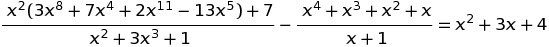

Here the following code is an example of how you could easily handle an equation, even of this type with the only hard part being writting it down.

```python

from libs import pythematics as pl

x = pl.x  # Declare the x variable

# First Long Term
numerator0 = x ** 2 * (3 * x ** 8 + 7 * x ** 4 + 2 * x ** 11 - 13 * x ** 5) + 7
denominator0 = x ** 2 + 3 * x ** 3 + 1

# Second Long Term
numerator1 = x ** 4 + x ** 3 + x ** 2 + x
denominator1 = x + 1

side2 = x ** 2 + 3 * x + 4  # Second side of the equation

# Get rid of the fractions
lcm_mul = pl.LCM_POL(
  denominator0, denominator1
)

frac_0 = (numerator0 * lcm_mul) / denominator0  # First Fraction
frac_1 = (numerator1 * lcm_mul) / denominator1  # Second Fraction
side2 *= lcm_mul  # Multplie the other side as well
side1 = frac_0[0] - frac_1[0]  # The first side
final_polynomial = side1 - side2  # Bring Everything to one side
roots = final_polynomial.roots(iterations=1000)
print(final_polynomial)  # The Polynomial into it's final form

for root in roots:  # Validate The result
  print(root)  # Print the root
  func_root = final_polynomial.getFunction()(root)  # Substitute the root into the Polynomial function
  print(func_root)
  print("\n")
```
And in just a few **mili-seconds** We are able to get the following results from our calculations but **NOTE** : Here we are dealing with a **14th** Degree Polynomial and we are trying to find all it's roots so to be safe we increased the iterations to **1000** to get an accurate result even though the results are also as accurate at **300** iterations

Every single Result is a complex number that looks something like this `(1.032132131e-14+3.312312e-15j)` which means it's that number raised to the **-14th** Power which is ultimately very close to zero


The output was long enough, that it did not fit into the screen, but you can see the exact **Output** [here](https://github.com/Greece4ever/pythematics/blob/master/Examples/complicated_equation_output.txt).

Another thing  this library is **greatly** capable of doing is pretty much every **Linear Algebra Operation**

Let's consider the Following System of **5** Linear equations

> 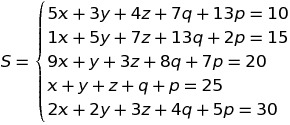

We can easily solve that system by transforming the equations  into the **Coefficient** Matrix,giving a tuple containing the name we choose for our each one of our **Unknowns** and passing the **Outputs** of each equation as a separate instance of the class  **Vector**

```python
# The Matrix of Coefficients
A = Matrix([
	[5, 3, 4, 7, 13],
	[1, 5, 7, 13, 2],
	[9, 1, 3, 8, 7, ],
	[1, 1, 1, 1, 1],
	[2, 2, 3, 4, 5]
])

unknowns = ('x', 'y', 'z', 'q', 'p')  # The unknowns
Output = Vector([10, 15, 20, 25, 30])  # The column that is going to make the augmented Matrix

print(A.calculateForX(
	Output, unknowns, useRef=True  # Solving Using Row Reduction
))

print(A.calculateForX(
	Output, unknowns, useRef=False  # Solving Using Determinants
))
```
- **Output**

```
{'x': 10.791457286432163, 'y': 7.851758793969854, 'z': 28.090452261306538, 'q': -17.1105527638191, 'p': -4.623115577889449}
{'x': 10.791457286432161, 'y': 7.851758793969849, 'z': 28.09045226130653, 'q': -17.110552763819097, 'p': -4.623115577889447}
```

Here you were Presented with some of the **capabilites** of this library but there's a lot more than you can do, and in fact **Pythematics** can also act as a **totally** basic math library since it includes (Too name a few) a:
- **Trigonometric** Module `trigonometric.py`
- **Random** Module `random.py`
- **Powers-Functions** Module `powers.py`-`functions.py`
- **Number Theory** Module `num_theory.py`

## Table of Contents

- [**Working with Polynomials**](working-with-polynomials)
  - [Getting to know the basics by solving 2 equations](#getting-down-to-the-interesting-stuff)
     - [Basic Linear Equation](#first-degree-linear-equation)
     - [More complex equations with fractions](#second-Example-with-polynomial-division)
  - [Root finding methods (Generalised)](#root-finding-methods)
  - [Delving deeper into Polynomials](#delving-deeper-into-polynomials)

- [**Linear Algebra Operations**](#linear-algebra)
   - [Some Very Basic Operations (Adittion, Subraction,Multiplication and Vector Products)](#basic-operations)
   - [Learning The fundamental Operations while finding the Eigen-Vectors and Eigen-Values of a Matrix](#learning-the-operations-by-finding-the-eigen-vectors---values-of-a-matrix)
        - [The Determinant](#determinant-in-detail)
        - [Solving Linear Equations](#linear-systems-of-equations)
        - [Mapping Each Element of a Matrix](#mapping-items-of-a-matrix)
    - [List of useful Additional Methods](#aditional-methods)
- [**Additional** functions-methods for computations](#additional-computational-methods)
  - [Using **Integration** and **differentiation** to solve common problems](#using-the-derivative-to-approximate-roots)
    - [**Newton**'s method for computing roots](#integration-and-derivation)
    - [The **Area** under a curve](#area-under-a-curve)
  - [Using The **GCD** to convert a floating point value into **integer** Division](using-the-gcd-to-convert-a-float-to-an-integer-fraction)

## Working with Polynomials
> Determining the roots of polynomials, or "solving algebraic equations", is among the oldest problems in mathematics. However, the elegant and practical notation we use today only developed beginning in the 15th century. Before that, equations were written out in words. For example, an algebra problem from the Chinese Arithmetic in Nine Sections, circa 200 BCE, begins "Three sheafs of good crop, two sheafs of mediocre crop, and one sheaf of bad crop are sold for 29 dou." We would write 3x + 2y + z = 29. - Wikipedia

In this submodule you don't have to use the old technique the **Ancient Chinese** had to use for Polynomial Operations but instead you can do it in a fully Pythonic way 

### Sections (Polynomials)
- [Getting to know the basics by solving 2 equations](#getting-down-to-the-interesting-stuff)
    - [Basic Linear Equation](#first-degree-linear-equation)
    - [More complex equations with fractions](#second-Example-with-polynomial-division)
- [Root finding methods (Generalised)](#root-finding-methods)
- [Delving deeper into Polynomials](#delving-deeper-into-polynomials)


You can easily work with Polynomials via the `polynomials.py` module

Here you use polynomials as per their default definition :
> In mathematics, a polynomial is an expression consisting of variables (also called indeterminates) and coefficients, that involves only the operations of addition, subtraction, multiplication, and non-negative integer exponentiation of variables (Wikipedia forgot division).

- Assuming that you do not re-define `x` you can simple use this all for you operations

```python
import pythematics.polynomials as pl

x = pl.x #You define the 'x' variable
P = 3*x+1
```
This would give the following output aimed at visualiazation:

```
Polynomial of degree 1 : 3x + 1
```

### Getting down to the interesting stuff

In the following two examples we will bring these two Polynomials into a solvable form performing math operations such as bringing all variables to one side and performing various Polynomial Operations. After that we will see a very **POWERFUL** method that can sove any Polynomial equation once it is brought into form, and discuss about other non-Polynomial ways of solving any Equation you can think of.


Let's consider the Following 2 algebraic equations : 
- **First** Degree 

>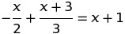

- **Uknown** as of now Degree (*Polynomial Division*)

>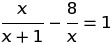

### First Degree Linear Equation
We will begin by writting out the equation and for convenience we are going to split it into variables


```python
import pythematics.polynomials as pl
x = pl.x

term_0 = - (x / 2)
term_1 = (x+3) / 3
side_0 = term_0 + term_1 #The first side of our equation
side_1 = x + 1 # The second one
final_polynomial = side_0 - side_1 #Bring everything to one side
```
Basically right now we've almost solved this equations by **JUST WRITTING IT**, in more Depth see what is going on at each variable declaration if we print everything


```
Polynomial of degree 1 : - 0.5x // term_0 (Divides x by 2 and taktes the negative of that)
Polynomial of degree 1 : 0.3333333333333333x + 1 //term_1 (Divide x and 3 by three)
Polynomial of degree 1 : - 0.16666666666666669x + 1 // side_0 (add term0 and term1)
```
And thus the result is the difference of the 2 sides `side_0 - side_1 = 0` :
```
Polynomial of degree 1 : - 1.1666666666666667x 
```
Of course the root here is easy to find and it's zero (Because the remainder difference of the two sides `side_0-side_1` is equal to one) and we did not have to use a root finding method or do anything complex other than just write the equation, but what if things are not so simple?

 ### Second Example with Polynomial Division


Here we can see 2 fractions that are both being divided by a Polynomial

- You could try doing Polynomial division in the first expression but you would end up doing nothing helpful
- In the second expression you can't do anything

Here is where `LCM` (Least common multiple) comes in handy (The equivalant of LCM in `num_theory.py`) . We are going to repeat what we did before but with a few adjustments
```python
#Find the LCM of x+1 and x (The terms that we are dividing with)
pol_lcm = LCM_POL(
    x+1,x
)

 # we multiply everything by pol_lcm (To get rid of the division)
term0 = (x * pol_lcm) / (x+1)
term1 = (8 * pol_lcm) / (x)
s0 = term0[0] - term1[0] #We are performing polynomial division which gives (Output,Remainder)
s1 = pol_lcm * 1 #Do not forget to multiple the next side as well with pol_lcm
final_polynomial = s0-s1 #Move everthing to one side
```
Now one way to get the root of this equation is by using  **Newton's method**

```python
from libs.pythematics.functions import NewtonMethod

f_p_function = final_polynomial.getFunction()  #Aquire the function of the pol (callabe)
root_0 = NewtonMethod(f_p_function, 2, iterations=50)  #Use 50 iterations to approximate and a start point
```
The output is `-0.888888888888889` which infact is the only root of this equation, still we haven't used are **best** tool for this because it would be overkill

Some things ought to be explained here in more depth:

#### What's going on during the division step?

> s0 = term0[0] - term1[0]

Here we are using indexes because the actual output is a list containing The result and remainder of the division 
```python
term0 = (x * pol_lcm) / (x+1) #Polynomial division works if the numerator is of higher degree than the denominator
print(term1)

>> [Polynomial of degree 1 : 8x + 8, 0] # Polynomial in 0 index and remainder in 1
```

The remainder can either be another Polynomial or a scalar value : `int`,`float` or even `complex`

In this case the `LCM_POL` which represents the LCM multiple of these polynomials:

> **Finds the smallest Polynomial that can equally be devided by all of these Polynomials**

In **every** case the division will have a remainder of 0 , so it is safe to always use the 0th term

#### Why use Newton's method? How does it even work? What else is there to use?

## Root finding methods

By definition **Newton's** method is described as : 

> In numerical analysis, Newton's method, also known as the Newton–Raphson method, named after Isaac Newton and Joseph Raphson, is a root-finding algorithm which produces successively better approximations to the roots (or zeroes) of a real-valued function (using fixed point iteration). - Wikipedia

You begin with a starting point `starting_point : Union[float,int]` and each time You solve the linear equation of the slope of function getting closer each time (finding the derivative of the function)

This technique and generally all techniques that include fixed point iteration are very powerfull and that's a reason why all the following functions that you will now see use it as well

Another alternative for real roots is the **Secant** Method which does the same but with 2 points

```python
final_polynomial = s0-s1
f_p_function = final_polynomial.getFunction()
root_0 = SecantMethod(f_p_function,1,2,2) #(input function,starting_point_1,point_2,iterations)
print(root_0)
```
This outputs `-0.8888888888888888` as well but with only 2 iterations and no derivative computation

The secant method needs just few iterations to find the result and because it converges very fast this often causes `ZeroDivisionError` errors at even a few iterations more than normal 

The number we chose was `2`, at the very next number `3` it causes an Error

```
ZeroDivisionError: float division by zero
```

Perhaps the most **powerful**  method is the **Durand–Kerner** method which gives all complex roots of Polynomial equations, the only downside being this is limited to Polynomials (On the other hand Newton and Secant work on non-polynomial equations)

Let's consider the following Polynomial

```python
P = x**2 - 8*x - 9 #You can generate this using s0-1 from the equation example
```
To get all of it's roots we can apply the above method as follows

```python
roots = P.roots(iterations=50)
print(roots)
#or if you wish by the functional method
adjusted_polynomial = reduceCoefficients(final_polynomial)
roots = applyKruger(adjusted_polynomial.getFunction(),adjusted_polynomial.degree,50)
print(roots)
```
The output in both cases is exatctly the same

```python
[(-1+0j), (9+0j)] # A list of complex numbers which are the roots (Generated in iteration 10)
[(-0.9999999869391464-4.333046649490722e-08j), (8.999999986939148+4.33304664947988e-08j)] #Iteration 9
```
This method also requires some starting points but because it doesn't really matter, they are automatically generated completely randomly using `pythematics.random`

Notice how in the functional method we used `reduceCoefficients(final_polynomial)`, what this does is, Makes sure that the leading coefficient of the Polynomial is 1 as is required per the **Durand-Kerner** method, so,ething you don't have to worry about if calling the method `instace_of_polynomial.roots()`

Also you are offered the ability to adjust iterations and benchmark yourself

Here is a more practical Example

> 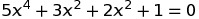

```python
P = 5*x**4 + 3*x**2 + 2*x**2 +1
roots = P.roots(iterations=50)
for root in roots:
    print(f'{root} : {P.getFunction()(root)}') #getFunction() returns a lamda Function of the Polynomial
```
- Output
```
-0.5257311121191336j : 0j
0.5257311121191337j : 0j
-0.8506508083520399j : 0j
0.8506508083520399j : 0j
```

Also something to note here is that the result will always be declared as a complex number even when the output is only real (No checking is done)

> REMINDER : **Durand-Kerner** is for polynomials only

## Delving deeper into Polynomials

As of now all Polynomial arithimtic was defined using `x = pl.x ` and normal operations giving it a nice Pythonic feeling, and clearly it is just a more natural way 

```python
P = x*(x+1) + x**2 + 3*x +1 #This feels way to Pythonic
```
But that is not how the system interprets it and there are some other methods to declare an instance of Polynomial

```python
P = Polynomial([3,4,1]) #The Class method of doing it which explains how everything works
G = PolString("x^2 + 4x + 3") #The string method of doing it
#In fact pl.x is just the following
x = PolString("x") #or
x = Polynomial([0,1])
```
This would output the following Polynomial
```
Polynomial of degree 2 : 1x^2 + 4x + 3 #P and G
Polynomial of degree 1 : + 1x #x
```

Despite the existance of the functions `derivative` (or `derivativeNth`) and `integral` in **functions.py** which work at all cases perfectly they do not actually provide an observable and visualizable formula and to achive this you can use the `.diffrentiate` and `.integrate` methods for Polynomials

```
P = Polynomial([3,4,1])
print(P.diffrentiate()) #Polynomial of degree 1 : 2x + 4 
print(P.integrate()) #Polynomial of degree 3 : + 0.333x^3 + 2x^2 + 3x
```

As a remainder you can use `polynomial.getFunction()` to get a callabe of the corresponding polynomial


# Linear Algebra

> There is hardly any theory which is more elementary (than linear algebra), in spite of the fact that generations of professors and textbook writers have obscured its simplicity by preposterous calculations with matrices. - Foundations of Modern Analysis, Vol. 1

That's **exactly** what this submodule aims to simplify and automate while giving a visual interpretation of what it is doing.


### Table of contents (Linear Algebra)

- [**Working with Polynomials**](working-with-polynomials)
  - [Getting to know the basics by solving 2 equations](#getting-down-to-the-interesting-stuff)
     - [Basic Linear Equation](#first-degree-linear-equation)
     - [More complex equations with fractions](#second-Example-with-polynomial-division)
  - [Root finding methods (Generalised)](#root-finding-methods)
  - [Delving deeper into Polynomials](#delving-deeper-into-polynomials)

- [**Linear Algebra Operations**](#linear-algebra)
   - [Some Very Basic Operations (Adittion, Subraction,Multiplication and Vector Products)](#basic-operations)
   - [Learning The fundamental Operations while finding the Eigen-Vectors and Eigen-Values of a Matrix](#learning-the-operations-by-finding-the-eigen-vectors---values-of-a-matrix)
        - [The Determinant](#determinant-in-detail)
        - [Solving Linear Equations](#linear-systems-of-equations)
        - [Mapping Each Element of a Matrix](#mapping-items-of-a-matrix)
    - [List of useful Additional Methods](#aditional-methods)

## Basic Operations

The way to Declare a **Matrix** is by passing a **list of lists**, each representing the row of the collumn, while on the other hand you declare a **Vector** by passing in an array of arguments.

The **following** Matrix and Vector Instances:

- Matrix
> 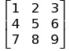 
- Vector
> 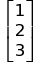

would be translated into this:

```python
from libs.pythematics.linear import *

#Create a Matrix passing rows
A = Matrix([
  [1, 2, 3],
  [4, 5, 6],
  [7, 8, 9]
])
# Or if you wanted to do the same with collumns
A_col = CreateMatrixPassingCollumns([
  [1, 4, 7], [2, 5, 8], [3, 6, 8]
])
# Declaring a Vector
B = Vector([
  1,2,3
])
```
And thus the Output would be a nice visual representation 

```cpp

 // Matrix A and A_col

 CI |   C1        C2         C3
 R1 |   1          2          3
 R2 |   4          5          6
 R3 |   7          8          8

3 x 3 Matrix

// The Vector

R1|   1
R2|   2
R3|   3

3 x 1 Vector array
```

Matrix-Vector Operations such as **Multiplication**, **Addition** and **Subtraction** are defined as they are used in Mathematics

- You can Only Multiply two **Matrices** **A** and B if the number rows of **A** is equal to the number of **collumns** of **B**.
- You can **Add** two **Matrices** **A** and **B** if they have the exact same dimensions (Rows,Collumns)
- The above also applies for Matrix **Subtraction**

- The only operation you can Perform with a **scalar** is multiplication (**Scaling** a Matrix)

The same **rules** apply to **Vectors** (Same dimensions for **Add (+)** AND **Sub (-)** and Only multiplication by a **scalar**) with The only Exception that there are 2 ways you can Multiply Vectors Togther:

- **Dot Product** outputs a Scalar

- **Cross Product** outputs another Vector

The **Dot** Product is well defined in any dimensions but the **Cross** Product if we stick to linear algebra is only defined on **3D** space (sometimes in **7D**) but can be generalised using complex math such as **Octanions** or **Quaternions**

To avoid **confusion** the cross Product of two Vectors remains in **3 Dimensions**

```python
A = Matrix([
  [1, 2],
  [3, 4]
])

B = Matrix([
  [1, 2, 3, 4],
  [5, 6, 7, 8]
])

w = Vector([
  1, 2, 3
])

v = Vector([
  4, 5, 6
])

angle = (w * v) / (magnitude(w) * magnitude(v))  #Or if you like
angle = w.dot(v) / (magnitude(w) * magnitude(v))

from libs.pythematics.trigonometric import arccos  #For Computing the angle

print(A * B)  #WARNING : B*A is not the same!
print(A + A)  #SAME DIMENSIONS 
print(w.cross(v))  #The Cross product of w and v
print(arccos(angle))  #The angle between Vector w and v in radians

```
- The **Output** (In order)

```c
// A*B

 CI |   C1        C2         C3         C4
 R1 |  11         14         17         20
 R2 |  23         30         37         44

2 x 4 Matrix

// A + A (same as 2*A)

 CI |   C1        C2
 R1 |   2          4
 R2 |   6          8

2 x 2 Matrix

//Cross Product

R1|  -3
R2|   6
R3|  -3

3 x 1 Vector array

0.22375608124549928 //The Angle in radians
```

Of course for finding the angle of two Vectors there already exists a function `AngleBetweenVectors` and for the magnitude `magnitude` but we just recreated it here for example purposes

## Learning the operations by finding the Eigen Vectors - Values of a Matrix

What [Eigen-Vectors](https://en.wikipedia.org/wiki/Eigenvalues_and_eigenvectors) and [Eigen-Values](https://en.wikipedia.org/wiki/Eigenvalues_and_eigenvectors) are does not really matter as we only need the Algorithm to compute them since many of the fundamental operations are Involved in this process. In addition, there already exists a callabe method `EigenVectors` or if you like `.EigenVectors()` but we're going to build it here from scratch for the sake of **Learning**

> Eigen-Vector of a square Matrix **A** is a Vector 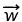 that when multiplied by a scalar **λ** it produces the same result as multiplying that scalar **λ** with Matrix **A**. Mathematically :  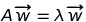, where both sides are Vectors

The Method for computing them for an **NxN** Matrix goes as follows

>Find The **Characteristic-Polynomial** of that Matrix by doing the following steps:
   - Multiply The n dimensional **Identity Matrix** with **λ** (**λ** here acts as a Polynomial) and subtract the result from **A**
   - Find the Determinant of the Matrix generated above

The determinant will return a **Polynomial** (as the name suggests) whose **roots** are the **eigen-values** of the Matrix **A**.

> Proceed with the following steps
* Compute the roots of the **Characteristic-Polynomial** and store them in memory in an array as **roots**
* Get the Matrix from the very first step **A**-(**λ** * **Identity Matrix**) store it in memory as **sub**
- Declare a Dictionary **dict** Where we're storing the **Eigenvalues** with their coressponding **Eigenvectors**

Now Perform the following steps (in pseudo-code)

- **for** each **root** in **roots** (roots of the **Characteristic-Polynomial**)
   - **Take** the Matrix **sub** (First Step) and wherever you see **lamda** substitute the **root**
   - **Take** the above **Matrix** and Solve the Corresponding System with target output the **0 Vector**
   - **Take** all the solutions from the above **result** put them in a Vector and insert that Vector into **dict** with a key of **root**  `{root:result}`


**That's it**, if you did not understand any steps, no worry, you can continue and see the real code

### Using The Real Code

First we need to make a function that finds the **Characteristic-Polynomial** but because we need to perform operations with **Polynomials** we need to import the coresponding module (if you want more info about Polynmials check [here](#TODO))

```python
import libs.pythematics.linear as lin  #For Matrix-Vector stuff
import pythematics.polynomials as pl  #Working with Polynomials

x = pl.x  #Instead of lamda we are going to use x
```

Now we need to find a Way to get the Identity matrix of **N** dimensions and also find a **determinant**, and luckily, there exists a function `IdenityMatrix` and a `determinant` one, and also all the Matrix operations are also defined so we are **OK**

```
def characteristic_polynomial(square_matrix : Matrix): 
    assert square_matrix.is_square() #DO NOT FORGET TO CHECK IF THE MATRIX IS SQUARE
    A = square_matrix 
    dimensions : int = A.__len__()[0] #Returns (Rows,Collumns) either will do, (square-matrix they're equal)
    identity_matrix : Matrix = IdenityMatrix(dimensions) #The Idenity Matrix
    polynomial_matrix : Matrix = A - (x * identity_matrix) #Subtract the scaled matrix from A
    det : pl.Polynomial = scaled_matrix.determinant() #Find the Determinant
    return det,polynomial_matrix 
```

Here I'm declaring the type of each variable so as for the code to make more sense

- `A.__len__()` returns the dimensions of the matrix but because it is square, they are exactly the same
- `A - (x * identity_matrix)` Operations with normal numbers as well as Polynomials are well defined
- `det` which is the determinant of `polynomial_matrix ` will produce a Polynomial in this case

- `return det,polynomial_matrix` We need both the **Polynomial** and the **Matrix** for further computations (see above)


> Do not forget that `.determinant()` (or `determinant(matrix)` if you wish) is only possible if the Matrix has the **same** number of **rows** and **collumns** - **Square** Matrix

**NOTE** : `polynomial_matrix` will produce a Polynomial in this case (Point **3**)

In this specific case we have a Matrix that consists of Polynomials and calculating the **Determinant** involves some Polynomial Operations since they are treated normally as Any Number, For **Example**:

### Determinant In Detail

A determinant is usefull for many things such as Matrix **inversion** and **Solving** linear systems and in fact many of the **built-in** functions (the module) are based on the determinant such as`.inverse()` - `inverse` and `.solve()` - `solveCramer`.

For computations the module uses **Cramer's** recursive rule for computing the determinant

```python
A = IdenityMatrix(dimensions=3) #The Identity Matrix
B = Matrix([
    [1,2,3],
    [4,5,6],
    [7,8,9]
])
x = pl.x #The polynomial 'x'
polynomial_matrix = A*(x+1)
print(B)
print(B.determinant())
print(polynomial_matrix)
print(polynomial_matrix.determinant()) 
```
- **Output** (In order)

```c

 CI |   C1        C2         C3
 R1 |   1          2          3
 R2 |   4          5          6
 R3 |   7          8          9

3 x 3 Matrix

0 // The determinant of the integer Matrix above

 CI |   C1        C2         C3
 R1 | (x+1)        0          0
 R2 |   0        (x+1)        0
 R3 |   0          0        (x+1)

3 x 3 Matrix

Polynomial of degree 3 : x^3 + 3x^2 + 3x + 1 //The determinant of the Above polynomial Matrix
```


Now we need to define our function that actually finds the Eigen-Values and for that we need
 1. Another function for  finding the **roots** of the Polynomial which are the **Eigenvalues**
 2. A Method to Solve a system of linear equations which will give us the **Eigenvectors** 

The corresponding methods are `.roots` for the **Polynomials** and `.solve` for the **Eigenvectors** and Specifically

> `matrix.solve(unknowns : Union[tuple,list],output : Vector)`, We need to provide a tuple or a list containing the names of the variables we need to solve for and the desired output we want to get

### Linear Systems of Equations

To better understand how the `.solve()` method works consider the following system of equations

> 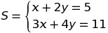 

If you were to solve this system using **Cramer's Method**  (`SolveCramer`) or by **Row-Reduction** (`solveREF`) You would Probably Write the system of equations in the following **Matrix** format in a similar or exactly this format

> 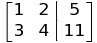

and here that's exactly what you need to pass but in a slightly different format

- The **Outputs** : **5** and **11** as a `Vector`
- the **Unknowns** : **x** and **y** as a **list** or a **tuple** `('x','y')`

```python
import libs.pythematics.linear as lin

A = lin.Matrix([  #The Coefficient Matrix
  [1, 2],
  [3, 4]
])

unknowns = ('x', 'y')  #The Unknowns
output = lin.Vector([5, 11])  #The output that will make the augemented Matrix
solution1 = A.solve(output, unknowns)
solution2 = A.solve(output, unknowns, useRef=True)
print(solution1)
print(solution2)
```
Here we in `solution2` we are setting `useRef=True` which means that we are solving the system by row reduction while on `solution1` we are using **Cramer's** method of the determinants, and in both cases the result is the same of-course

> `{'x': 1.0, 'y': 2.0}`

or if you for whatever reason do not like the class-method of doing it you can instead use

```
cramer = lin.SolveCramer(A,output,unknowns) 
reduction = lin.solveREF(A,output,unknowns)
```

In general `useRef=True` or if you like `solveREF` is more powerful that `solveCramer` in situations where there are infinitely many solutions, when **Cramer's Method** fail's if you specify the parameter `ContinueOnFail=True` it will solve the remaining equations picking the value "1" for the **free** variable (That's the default) (**AND THE METHOD IT WILL USE WILL BE ROW REDUCTION**) which you can of course change if you explicitely call `solveREF` and set the parameter `onFailSetConst`. if there are **NO** (Rank of **Coefficient** Matrix is less than rank of **Augemented** Matrix) solutions it will throw an `AssertionError`

Here in our example the Matrix that will be produced (by substitution) will always have infinite solutions so we are going to use **Row Reduction** to improve Performance

Continuing on where we left, we know we can Solve the Polynomial equation and the Linear system but how can we substitute the eigen Vectors wherever we see **lamda**?

### Mapping Items of a Matrix

The answer to this is the `.forEach()` method which for each element of the Matrix it Applies a certain function and returns a new **Matrix** with that function applied to every element - something like array **
map**

```python
from libs.pythematics.functions import exp


def sigmoid(x):
  return 1 / (1 + exp(-x))


print(A.forEach(sigmoid))

#  CI |   C1        C2
#  R1 |  0.98       0.73
#  R2 |  1.0        0.95

# 2 x 2 Matrix
```
The Polynomial Matrix we Generate will look some like this (the **sub** Matrix from the very first step)

```c
 CI |   C1        C2
 R1 | (-x+4)       1
 R2 |   6        (-x+3)

```

Then you can get the **Polynomial** as a function is by using the `.getFunction()` method, which will return a fully usable lamda function

So to substitute for each element we are goind to use the `.forEach()` method and define a new function `substitute` which given a number it will substitute it into any Polynomial it finds

```python
import pythematics.polynomials as pl

x = pl.x

def substitute(expression ,number):
    if not type(expression) == type(x):
        return expression #if not a Polynomial simply return the expression
    return expression.getFunction()(term)
```
And now since we know everything, we can complete our function

```
def eigenvectors(matrix):
    char_pol = CharacteristicPolynomial(matrix) #Find the Characteristic Polynomials and the sub Matrix
    char_pol_roots = char_pol[0].roots(iterations=50) #Find the roots of the 1st element (Polynomial)
    sub_matrix = char_pol[1] #The 0th element is the sub matrix
    output = Vector0(dimensions=matrix.__len__()[0]) #Our Target is the 0 Vector of N dimensions 
    unknowns = [i for i in range(matrix.__len__()[0]) #The names of our 'unknowns'
    eigen_dict = {} #The Dictionary in which we will store the Values with their Vectors
    for root in char_pol_roots:
          m_0 = sub.forEach(lambda num : substitute(num,root)) #Substitute the Eigen Values in the Lamda scaled Identity Matrix
        eigen_vector = m_0.solve(output,unknowns,useRef=True) #Solve the linear system
        eigen_vector = Vector([eigen_vector.get(sol) for sol in eigen_vector])
        eigen_dict[root] = eigen_vector #Eigen value has a coressponding Vector
        #Insert into the dictionary the root with it's eigen Vector
```
Each **eigenvalue** has **infinite** coressponding **eigenvectors** but we are only goind to return one for the sake of simplicity (You can find them by instead of substituting the number **1** to use another Polynomial to get a formula, while Solving the **Linear Equations**)


To test our function we're going to use The following simple **2x2** Matrix

> 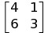

```python
from libs.pythematics.linear import *

A = Matrix([
  [4, 1],
  [6, 3]
])

vs = EigenVectors(A)
for item in vs:
  print(A * vs[item])
  print(item*vs[item])
```

- **Output**

```cs
 CI |   C1
 R1 | -0.33
 R2 |   1

2 x 1 Matrix


R1| (-0.3333333333333333+0j)
R2| (1+0j)

2 x 1 Vector array


 CI |   C1
 R1 |   3
 R2 |   6

2 x 1 Matrix


R1| (3+0j)
R2| (6+0j)

2 x 1 Vector array
```

And in fact it is correct (**despite** a small floating point Error in the first **Vector**)

### Aditional Methods

**Methods** and their corresponding **functions** for Matrix Manipulation

|Method|Functional |Description|
|-------------------|---|---|
|`.inverse()`     | `inverse`   |Finds the Inverse of a square Matrix   |
|`.ref()`| `ref`  | Returns the REF of a Matrix   |
|`.determinant()`         |`determinant`   | Finds the Determinant of a square Matrix  |
|`.transpose()` |`adjugate`   |Returns the passed Matrix Transposed   |
|`cofactors()`    | `MatrixOfCofactors`  |Returns the Matrix of cofactors of a Matrix   |
|`.minors()`    |`MatrixOfMinors`   |Returns the Matrix of Minors of a Matrix   |
|`.trace()`      |`Trace`   |Returns the sum of the diagnals   |
|  None         |`IdenityMatrix`   |Returns the Identity Matrix of N dimensions   |
| `.swap`          |    `SwapNoCopy`              | Swaps 2 rows of a given Matrix                    |

**Methods** for Solving systems of Equations

|Name|function |Description|
|-------------------|---|---|
|Row Reduction     | `.solve(useRef=True)` and `solveREF`   |Solves using row Reduction   |
|Cramer's rule| `.solve` and `solveCramer`  | Finds determinants recursively|

**Vector** Operations - Methods for manipulation

|Method|Functional |Description|
|-------------------|---|---|
|`.dot()` or by * operator     | `dot`   |Dot Product of 2 Vectors|
|`.cross()`| `cross`  | Cross Product of 2 3D Vectors|
|`.magnitude()`         |`magnitude`   | Magnitude of a Vector |
|`.AngleVector()`         |`AngleBetweenVectors`   | Returns the angle between 2 Vectors |


## Additional Computational Methods
> A few examples on other parts of the library that are worth a mention

## Integration and Derivation

### Using the Derivative To approximate roots

Using the `pythematics.functions.derivative` function you can find the derivative of any given function at a specific
point

```python
from libs.pythematics.functions import derivative

print(derivative(lambda x: x**2,1))
```
This outputs `2.000099999999172`, which despite the small floating point error is in fact correct

We can now take advantage of this and start approximating roots using **Newton's Method** which is defined as follows

> 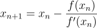

Essentialy what this means is that the next term of `x` will be equal to `x` minus it's function divided by it's
derivative

```python
from libs.pythematics.functions import derivative


def Newton(f: callable, x: float, iterations):
  for _ in range(iterations):
    x -= f(x) / derivative(f, x)
  return x


f = lambda x: x ** 2 - 2  #The root of this function is the sqrt(2)

print(Newton(f,1,50))
```
The approximation is `1.414213562373095` which indeed is very close to `sqrt(2)`

You can also compute higher order derivatives using `nthDerivative` but the sequence quickly diverges at around derivatives of order `4` due to **floating error**

### Area Under a Curve

This is really straight-forward and is made just to introduce the `integral` function, in fact all you have to do is pick a function and two points calculate the integral a two points and subtract the One from the other

```
from pythematics.functions import integral

function = lambda x : x # x**2 / 2

def AreaUnderCurve(f : callable,x1 : float,x2 : float) -> float:
    p1 = x1;
    p2 = x2;
    if x1 > x2:
        x1 = p2;
        x2 = p1;
    return abs(integral(f,x1) - integral(f,x2));


print(integral(function,1))  #0.5
print(integral(function,2)) #2
print(AreaUnderCurve(function,1,2))
```
- `0.49500010000000016` for 1
- `1.9900002000000012` for 2
- `-1.495000100000001` for the differnce

Of course again, there is a an error.


## Using the GCD to convert a float to an integer fraction
> The greatest common divisor (**GCD**) of two or more integers, which are not all zero, is the largest positive integer that divides each of the integers **equally**. - Wikipedia

When you see a **decimal** number the easiest way to convert it to an integer fraction is by multiplying it by `1e+n` (Pythonic scientific notation) where `n = number of numbers after the "."` so `1.4142` would be `14142 / 1000 `

But this can be simplified even more if you find a number that equally divides the **numerator** and the **denominator** and since `GCD` returns the **greatest** number, we have to repeat this proccess until this number is `1`

```python
def IntegerDivision(num : float) -> Tuple[int]:
    dec_num = len(str(num).split(".")[1])
    expon = 10 ** dec_num
    nom_denom = (expon * num,expon) #Simplified by 10 to an exponent simplification
    g_c_d = GCD(nom_denom[0],nom_denom[1]) #Their GCD
    while g_c_d > 1:
        nom_denom = (nom_denom[0] / g_c_d , nom_denom[1] / g_c_d) #Simplify them by the GCd
        g_c_d = GCD(nom_denom[0],nom_denom[1])
    return (int(nom_denom[0]),int(nom_denom[1])) #Get rid of the .0 from the float division
```
Another very similar function to `GCD` is the `LCM` which stands for the **Least Common Multiple**, a function in which you check what the is lowest number that can be divided by all the arguments passed in.
